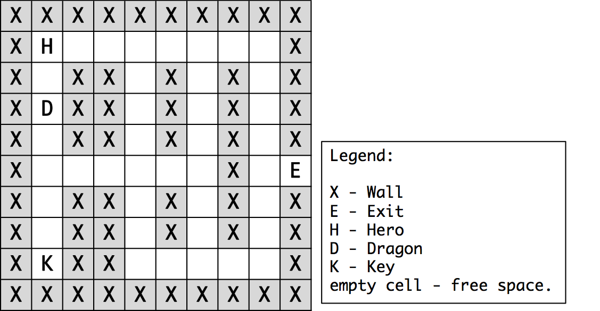

# "Here Be Dragons" (mini-quest I)

### Running the game
 - Clone this repository, and make sure you have [Python 3](https://www.python.org/) installed
 - Execute `python3 main.py` on a terminal

The script only depends on standard Python libraries.

This project is licensed under the [GNU General Public License v3.0](https://www.gnu.org/licenses/gpl-3.0-standalone.html)

---

### Context

In this mini-quest, you are asked to portray the classical situation of "The Maze and The Dragon", which story follows:

> "You awake still shattered from your last encounter...all is still fuzzy in your mind as you don't have any recollection on how you got to where you are...you can see a poorly-lite corridor and feel the damp smell of closed quarters. Where are your things? You are still dressed in your leather clothes but no weapons or armour. Where are you? What dangers lie beyond?... A tinkle in the back of your head tells you that you must leave this place as fast as you can..."

Note: You are expected to use either Java or C++ to undertake this quest, with the IDE of your choice. At this point, there is no need to use classes, only the main program and/or auxiliary methods so that the code is modular, reusable and clearer. (KISS)

**Task #1. Basic Game Logic**

* Let's start with the game map. Store in memory and print out (on console) the following map (no colours, textual characters only). Hint: Use a two-dimensional array, initialised on the declaration.
 

 
* The user should be asked to enter single-character commands to move the main character ("hero") in 4 possible directions (up, down, left, right). If there is a wall or door in that direction, the hero remains in the same position. Upon entering each command, the program should update the game and reprint the game map. Hint: For the Java version, use the Scanner class for input. For the C++ version, use cin for input and cout for output.
 

* The hero needs to pick up (walkover) the key ('K') to open the dungeon exit door ('E'). If the hero reaches the exit without the key, it cannot leave the dungeon (the exit is closed). If the hero gets anywhere near the dragon (any adjacent square, except diagonals), it is immediately killed, and the game is over. At this point, the dragon is asleep and does not move, so the hero should be safe, as long as it keeps away from him. When reaching (stepping over) the open exit door, the game ends with victory.

   
* The exit is randomly placed on the maze when the game launches in a valid position. This means the exit can only be placed on the outer wall (except on the vertices), without any other game elements (hero, dragon, key) on any of its adjacent inner positions. Assume that the hero, dragon and key element can be at any position (not just the ones shown on the original map).
